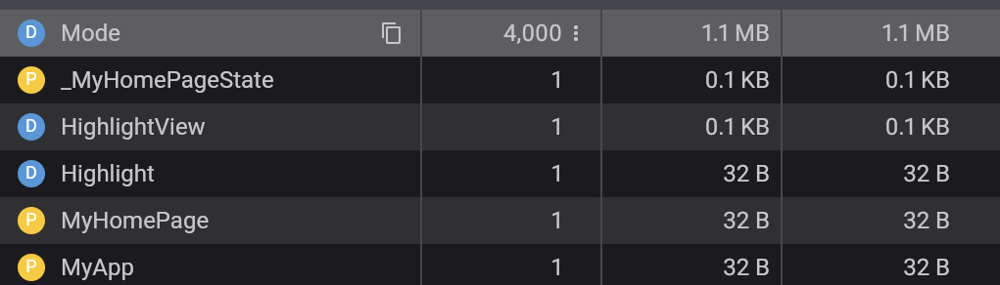

# flutter_highlight_fork

This repository is a fork of the [flutter_highlight](https://github.com/git-touch/highlight.dart/tree/master/flutter_highlight) project.


### Fork changes

- SelectionArea Support :
  Replacing `RichText` to `Text.rich` to enable text selection.

- Header:
  Added a header that displays the programming language and supports custom widgets, with dynamic colors derived from `themeMap`.

- Add lazyLanguages:
  Optimized the Mode class instantiation to reduce the number of instances created.

  Original :
  

  Fork :
  

## Getting Started

### Add dependency

```yml
dependencies:
  flutter_highlight_fork:
    git:
      url: https://github.com/hengkysteen/flutter_highlight_fork.git
      ref: v0.0.1
```

### Usage

```dart
import 'package:flutter_highlight_fork/flutter_highlight_fork.dart';

SelectionArea(
   child: HighlightViewFork(
      "void main()",
      language: "dart",
   ),
),
```

or copy complete example from `example/main.dart` and run it.

## References

- [highlight](https://github.com/git-touch/highlight.dart)
- [All available languages](https://github.com/git-touch/highlight.dart/tree/master/highlight/lib/languages)
- [All available themes](https://github.com/git-touch/highlight.dart/tree/master/flutter_highlight/lib/themes)
